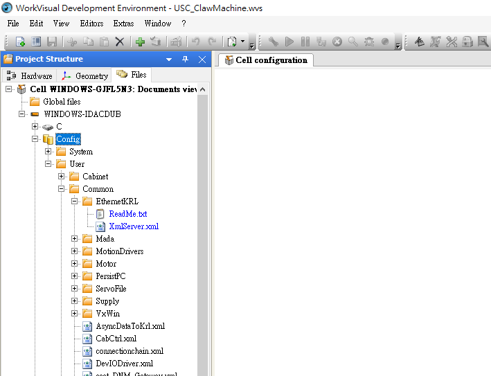

## 五、自動化專案實作 一
### KUKA Srver端通訊程式 EKI基礎

1. 網路通訊手臂EKI
  - EKI [參考文件](http://www.wtech.com.tw/public/download/manual/kuka/krc4/KST-Ethernet-KRL-21-En.pdf)(https://github.com/yazelin/usc2019-RobotSim/raw/master/src/XmlServer.zip)
  - Server設定
	  - 在Files中打開Config\User\Commoon\EthernetKRL\XmlServer.xml
	  

  ```xml
  <ETHERNETKRL>
	<CONFIGURATION>
		<EXTERNAL>
			<TYPE>Client</TYPE>   ;設定外部為Client
		</EXTERNAL>
		<INTERNAL>
			<IP>192.168.1.147</IP>	;設定連線IP
			<PORT>54600</PORT>		;這定通訊埠
			<ALIVE Set_Flag="1"/>	;當確定連線後Flag[1] = TRUE
		</INTERNAL>
	</CONFIGURATION>
	<RECEIVE>
		<XML>
		   <ELEMENT Tag="Data/Direction" Type="String" Set_Flag="2"/>	;設定接收到的資料 Tag="路徑" Type="資料型別" 接收資料後Flag[2]=TRUE
		</XML>
	</RECEIVE>
	<SEND>
		<XML>
		;此部分可設定手臂傳出資料 例:<ELEMENT Tag="Data/Direction" Type="STRING"/> 
		</XML>
	</SEND>
</ETHERNETKRL>
  ```

  - 在資料夾中新增程式
	  - 在 KRL\R1\Program\test 資料夾點擊右鍵 選取 Add>Module 加入後命名程式名稱


  - EKI手臂程式
  
  ```
DEF XmlServer( )
   INT i
   DECL EKI_STATUS RET
   CHAR valueChar[20]
   CHAR EOL[2]	
   EOL[1] = 13	;ASCII碼 13 = \r
   EOL[2] = 10	;10 = \n
   
   RET=EKI_Init("XmlServer")	;初始化
   RET=EKI_Open("XmlServer")	;開啟
   
   wait for $FLAG[1] 		;等待連線
   
   FOR i=(1) TO (20)		;需要先給初始值 否則程式會有錯誤
      valueChar[i]=0
   ENDFOR
   
   WAIT FOR $FLAG[2] == TRUE	;等待有資料傳入
   RET=EKI_GetString("XmlServer","Data/Direction",valueChar[])	;讀取資料存入valueChar[]
   
   MsgNotify(valueChar[])	;將資料印在Smart-Pad訊息欄上
   
   RET = EKI_Send("XmlServer", "Comfirm")	;傳送Comfirm確定有接收到資料
   RET = EKI_Send("XmlServer", EOL[])	;傳送換行字元
   
   ;Send 可將資料先進行存取在傳送
   ;例: RET = EKI_Set("XmlServer","Data/Direction", "Comfirm")
   ;	  RET = EKI_Send("XmlServer","Data/Direction")
   
   wait for $FLAG[1]==FALSE
   
   RET=EKI_Clear("XmlServer")
END
  ```

2. 程式上傳至手臂
- 需先變更電腦系統地區設定
	- 控制台>變更日期、時間或數字格式>系統管理>變更系統地區設定>選擇英文(美國)		         	PS.需要重新啟動電腦

- 將電腦IP設成和手臂相同網段
	- 開啟網路和忘記網路設定>變更介面卡選項>選擇乙太網路案右鍵>內容>網際網路通訊協定第4版(TCP/IPv4)
	
- 傳送程式至手臂端
	- 需先確認手臂用戶為Expert、並且無任何程式正在執行或預備狀態
	- PC與手臂進行網路線連接
	- 點選WorkVisual上方橘色向右鍵頭
	- 直接點選Finish
	- 手臂Smart-Pad點選Yes
	
3. 通訊測試
- 電腦PC連線測試
	- 開啟cmd命令提示字元
	- 輸入 telnet + IP + Port
	- 將XML格式複製 在cmd介面點擊滑鼠右鍵
 ```
IP 192.168.1.147
Port 54600
前 <Data><Direction>1</Direction></Data>
後 <Data><Direction>2</Direction></Data>
左 <Data><Direction>3</Direction></Data>
右 <Data><Direction>4</Direction></Data>
夾 <Data><Direction>5</Direction></Data>
```

- VisualStudio WinForm Client程式測試
	- 提示 - 需要注意程式IP位置設定


### 作業內容
- EKI程式內容運作
- 利用手臂與PC、WinForm進行通訊傳遞
PS. IP位置需要更改不得相同
<!--stackedit_data:
eyJoaXN0b3J5IjpbLTE5MTIyODIxMCwzODAyOTU4NDAsMTYwMT
E4NDkyNywtMTcwNjY0NzAzMywtMTM4NDI4NjY3NCwxNzg3ODM4
MjU1LDE3MzY3Mzg1OTEsLTE5MjQ4MzgyODgsMTg4MTI3MTQyNS
w4NjA4NDE5MjMsLTkyODU4NDU4MiwxNjUzMjA2MTE5LC0yMDI2
NzM4Mjk0LDE3NDY2NDAxNjMsMTc0OTY2NzEwNywxODExMTY1NT
kyXX0=
-->