## Basic operation

## Industrial Robot Introduction

### 6-axis Robots
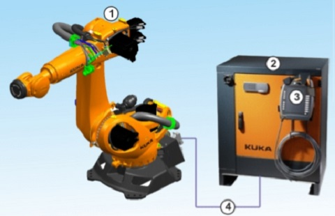

### Axis
- A1~A6 

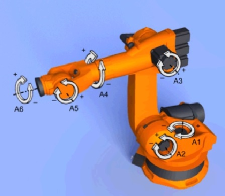

### Space
- Base Space

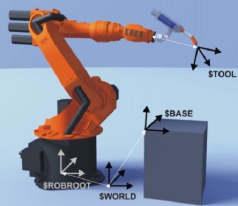

- Tool Space

 

### The basic concepts of robotics lon-line earning 
- Embeded RobotSim simulation on WebPlaer
-   [RobotSim WebPlayer](http://www.wtech.com.tw/robotsim/demo)
- The basic concepts of robotics includes
	- Coordinate systems
		- WORLD
		- BASE
		- TOOL    
	- Jogging Mode
		- Cartesian jogging with XYZ ABC according to the selected coordinate system
		- Axis-specific jogging
	- Motion type
		- PTP
		- LIN
		- CIRC
	- Axis Range Limitation
		- A1~A6
	- Teaching and Programing
		- Teach several points to create a robot motion path
		- Program robot running on the path repeatly by Loop function

## Basic operation 

### Download, installation and testing 
<iframe width="560" height="315" src="https://www.youtube.com/embed/xv4v_fOwAC0" frameborder="0" allow="accelerometer; autoplay; encrypted-media; gyroscope; picture-in-picture" allowfullscreen></iframe>

- Download link [link](http://www.wtech.com.tw/downloadrobotsim)
- Reference media [link](https://www.youtube.com/watch?v=xv4v_fOwAC0&index=20&list=PLYLTPJkULAAZZuNW2s2tX-KWQOus7sAAo).

### Teaching, programing and simulation
<iframe width="560" height="315" src="https://www.youtube.com/embed/4Gk7K88B10c" frameborder="0" allow="accelerometer; autoplay; encrypted-media; gyroscope; picture-in-picture" allowfullscreen></iframe>

- Reference media [Link](https://www.youtube.com/watch?v=4Gk7K88B10c&index=21&list=PLYLTPJkULAAZZuNW2s2tX-KWQOus7sAAo).

### Adding a tool
<iframe width="560" height="315" src="https://www.youtube.com/embed/NLA6A_qWDgs" frameborder="0" allow="accelerometer; autoplay; encrypted-media; gyroscope; picture-in-picture" allowfullscreen></iframe>

- Reference media [Link](https://www.youtube.com/watch?v=NLA6A_qWDgs&index=22&list=PLYLTPJkULAAZZuNW2s2tX-KWQOus7sAAo).

### Select tool, base, robot and program
<iframe width="560" height="315" src="https://www.youtube.com/embed/izkk5MW-FeY" frameborder="0" allow="accelerometer; autoplay; encrypted-media; gyroscope; picture-in-picture" allowfullscreen></iframe>

- Reference media [Link](https://www.youtube.com/watch?v=izkk5MW-FeY&index=23&list=PLYLTPJkULAAZZuNW2s2tX-KWQOus7sAAo).

## RobotSim Programming
-  Value
  - Bool、Int、Float、String
  - Set、Add、Sub、Mut、Div

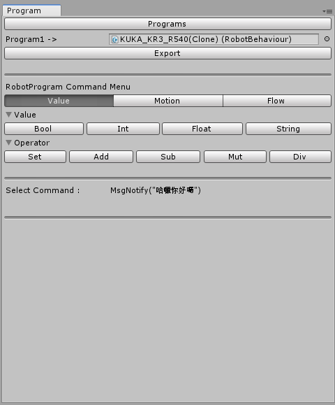 
-  Motion
  - Base、Tool、Speed
  - PTP 、LIN、CIRC

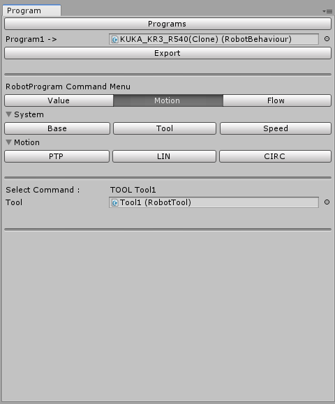 
-  Flow
  - Loop、For-Loop、Wait Time
  - If-Else、While、Switch-Case

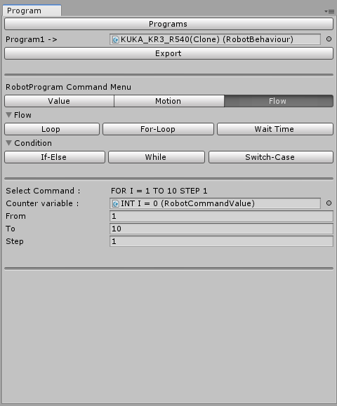

## Excises
- import RobotSim [download page](http://www.wtech.com.tw/robotsim)
- start Robot window、Program window、Controller window
- Add a empty space scene

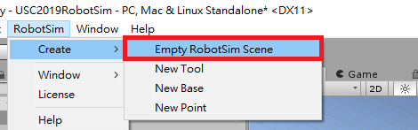
- Select a Robot

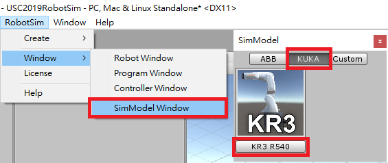
- Select a  Program

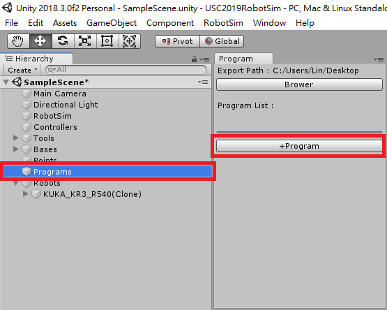
- Select Controller

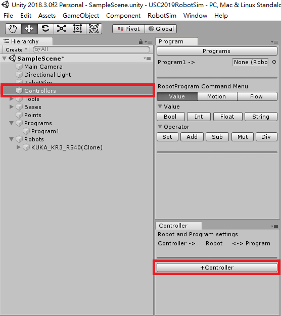
- Link Robot、Controller、Program

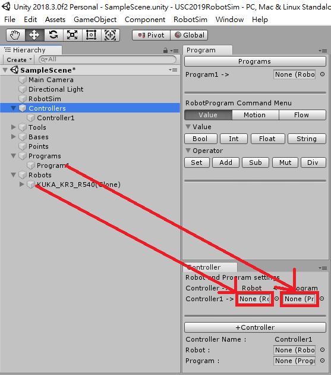
- Set up main camera

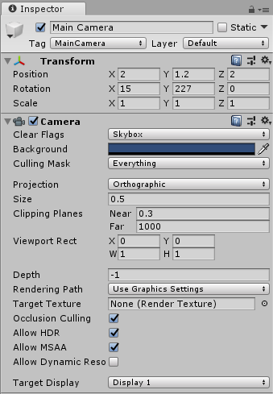
- Add point #1 and point #2.

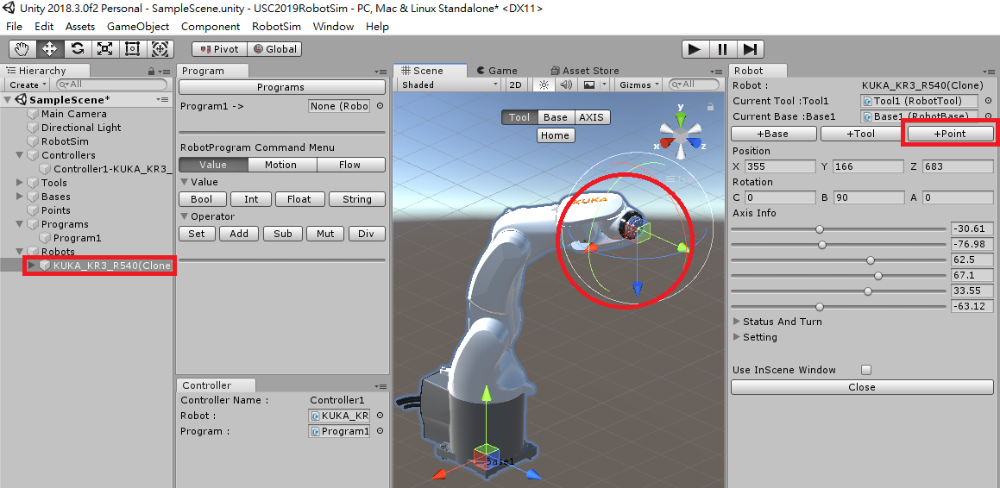
- Add motion type: PTP、LIN

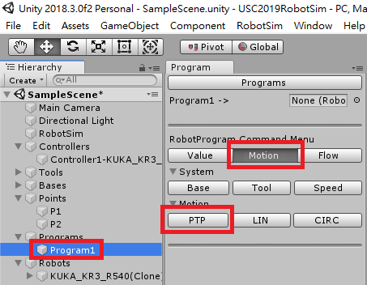
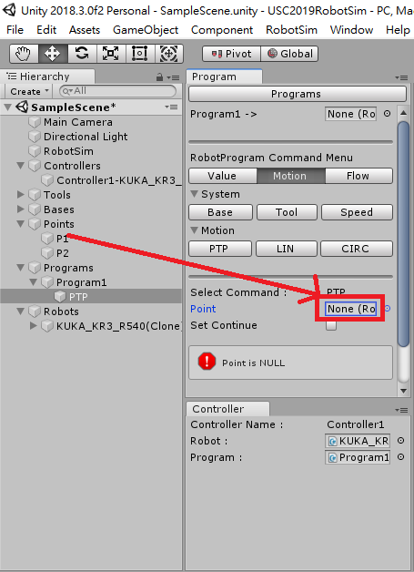
- Set up parameters、using FOR-LOOP for flow control

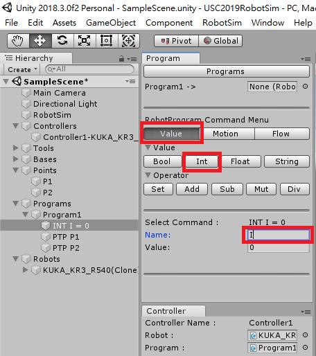
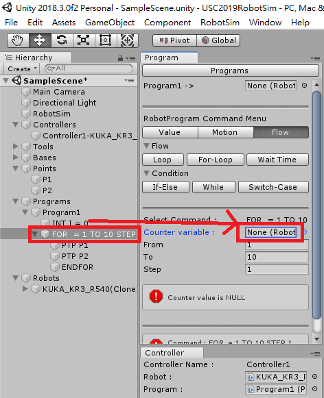
- Set up  SPEED、add WAIT SEC 

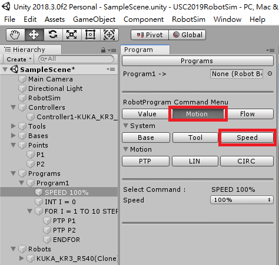
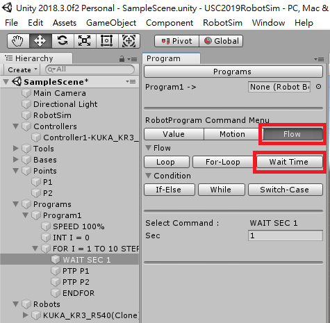

## Outputs
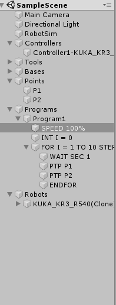
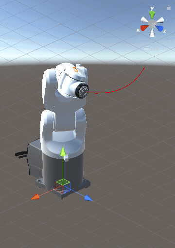

<!--stackedit_data:
eyJoaXN0b3J5IjpbMTgzMTI3ODYyNiwxMTkxODY2MjY4LDExOT
E4NjYyNjgsMTE5MTg2NjI2OCwxMTkxODY2MjY4LDExOTE4NjYy
NjgsLTE3NTk3Mjc4NjEsMTYyNzk0NTIwOCwtNTQ2NjI4MzMsMT
I3MTM5MzA3MSwtMTIxNjI5MDAzNCwtMTk3NzQxMzgyNiwzMTY2
NzY2NzcsOTY2MzE1NzQ5LDE2MjY5OTQwNTYsMTAwMTg4NjM0Ny
wzNjc4MDU1ODgsLTU0NzU2NjM0NCw1MDc2NzYwMDksLTExMzI3
MTA5Nl19
-->