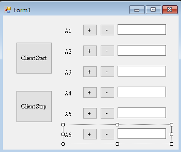
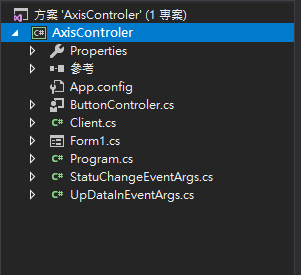
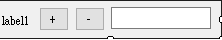
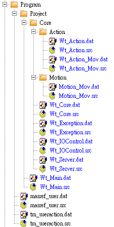

# 自動化專案實作加分題


<iframe width="560" height="315" src="https://www.youtube.com/embed/gm2w0d_TMHY" frameborder="0" allow="accelerometer; autoplay; encrypted-media; gyroscope; picture-in-picture" allowfullscreen></iframe>
- 影片[簡報](https://docs.google.com/presentation/d/1ZYj5mGjhTlnCzV6vPP70bwI-meQ7a0T_LexhN0AwzKM/edit?usp=sharing)

## 電腦 Client 端程式


- 使用者介面
- 

- 使用者控制項 ButtonControler - 點選專案AxisControler右鍵 > 加入 > 新增項目 > 使用者控制向 更名為 ButtonControler
- 
- 
	- 加入屬性
		- AxisID
		- CurrentPosition
	- 註冊事件

```cs
using System;
using System.Collections.Generic;
using System.ComponentModel;
using System.Drawing;
using System.Data;
using System.Linq;
using System.Text;
using System.Threading.Tasks;
using System.Windows.Forms;

namespace AxisControler
{
	public partial class ButtonControler : UserControl
	{

		public event EventHandler AddButtonClick;
		public event EventHandler DelButtonClick;       //burron click event
		
		public string CurrentPosition{ get { return txtAxis.Text; } set { txtAxis.Text = value; } }                  //record the current position
		private int axisID = 0;
		public int AxisID { get { return axisID; } set { axisID = value; labAxis.Text = "A" + value; } }  //set axis in controler
		
		public ButtonControler()
		{
			InitializeComponent();
		}

		private void button1_Click(object sender, EventArgs e)
		{
			AddButtonClick?.Invoke(this, e);        //Trigger AddButtonClick event
		}

		private void button2_Click(object sender, EventArgs e)
		{
			DelButtonClick?.Invoke(this, e);        //Trigger DelButtonClick event
		}
	}
}
  ```

- Form1 程式
	- 註冊事件
	- 事件出發後 顯示位置訊息、控制項的開關
	- 處理跨執行續問題
	- 設定Xml格式動作指令

```cs
using System;
using System.Collections.Generic;
using System.ComponentModel;
using System.Data;
using System.Drawing;
using System.Linq;
using System.Text;
using System.Threading.Tasks;
using System.Windows.Forms;

namespace AxisControler
{
	public partial class Form1 : Form
	{
		List<ButtonControler> controlers = new List<ButtonControler>();
		ClientExample client = new ClientExample();

		private string distancePositive = "10";
		private string distanceNegative = "-10";

		public Form1()
		{
			InitializeComponent();

			client.UpDataIn += Client_UpData;
			client.SatatusChanged += Client_StatusChanged;

			controlers.AddRange(new List<ButtonControler>() { buttonControler1, buttonControler2, buttonControler3, buttonControler4, buttonControler5, buttonControler6 });

			foreach (var item in controlers)
			{
				item.AddButtonClick += AxisControler1_OnAddButtonClick;
				item.DelButtonClick += AxisControler1_OnDelButtonClick;
			}

		}

		private void Client_StatusChanged(object sender, StatuChangeEventArgs e)
		{
			UIThread(this, () =>
			{
				foreach (var item in controlers)
				{
					item.Enabled = e.idle;                  //if robot idle, close button
				}
			});
		}

		private void AxisControler1_OnDelButtonClick(object sender, EventArgs e)
		{
			var axis = (sender as ButtonControler).AxisID;
			var dataSend = "<Distance><Axis Angle =\"" + distanceNegative + "\">" + axis + "</Axis></Distance>";
			client.Send(dataSend);
		}

		private void AxisControler1_OnAddButtonClick(object sender, EventArgs e)
		{
			var axis = (sender as ButtonControler).AxisID;
			var dataSend = "<Distance><Axis Angle =\"" + distancePositive + "\">" + axis + "</Axis></Distance>";
			client.Send(dataSend);
		}

		private void Client_UpData(object sender, UpDataInEventArgs e)
		{
			UIThread(this, () =>
			{
				buttonControler1.CurrentPosition = e.A1.ToString();
				buttonControler2.CurrentPosition = e.A2.ToString();
				buttonControler3.CurrentPosition = e.A3.ToString();
				buttonControler4.CurrentPosition = e.A4.ToString();
				buttonControler5.CurrentPosition = e.A5.ToString();
				buttonControler6.CurrentPosition = e.A6.ToString();
			});
		}

		private static void UIThread(Control control, Action code)
		{
			if (control.InvokeRequired)				//call otehr threads
			{
				control.BeginInvoke(code);
			}
			else
			{
				code.Invoke();
			}
		}

		private void ClientStart_Click(object sender, EventArgs e)
		{
			client.Start("192.168.1.147", 54600);
		}

		private void ClientStop_Click(object sender, EventArgs e)
		{
			client.Stop();
		}
	}
}
  ```

- 類別 Client
	- 傳送動作指令
	- 接收位置訊息
	- 取出Xml內容
	- 加入事件並且觸發

```cs
using System;
using System.IO;
using System.Net.Sockets;
using System.Threading;
using System.Threading.Tasks;
using System.Xml;

namespace AxisControler
{
	class ClientExample
	{
		TcpClient myClient;         //建立TcpClient
		public event EventHandler<UpDataInEventArgs> UpDataIn;
		public event EventHandler<StatuChangeEventArgs> SatatusChanged;
		private string sendData = string.Empty;
		private bool idle;
		private bool beforeIdle = false;

		public ClientExample() { }

		public void Start(string ip, int port)
		{
			if (myClient != null)        
			{
				return;
			}
			myClient = new TcpClient(ip, port);  

			Task.Run(() => ClientService());      //task run in other thread
		}

		public void Send(string data)
		{
			sendData = data;
		}

		private void ClientService()
		{
			while (true)
			{

				try
				{

					if (myClient != null)           //mtClient has entity
					{
						StreamReader streamReader = new StreamReader(myClient.GetStream());
						StreamWriter streamWriter = new StreamWriter(myClient.GetStream());

						while (myClient.Connected)
						{
							if (sendData != string.Empty) 
							{
								streamWriter.WriteLine(sendData);       
								streamWriter.Flush();                   //send "sendData"
								Console.WriteLine("Client To Server : " + sendData);

								var data = streamReader.ReadLine();     //read "Confirm"
								Console.WriteLine("From Server : " + data);

								sendData = string.Empty;
							}

							var dataPosition = streamReader.ReadLine();			//read position and idle
							Console.WriteLine("From Server : " + dataPosition);

							XmlDocument xmlDocument = new XmlDocument();
							xmlDocument.LoadXml(dataPosition);      //dataPosition set in xmlDocument

							var positionA1 = xmlDocument.SelectSingleNode("/Position/A1").InnerText;    //take Xml content
							var positionA2 = xmlDocument.SelectSingleNode("/Position/A2").InnerText;
							var positionA3 = xmlDocument.SelectSingleNode("/Position/A3").InnerText;
							var positionA4 = xmlDocument.SelectSingleNode("/Position/A4").InnerText;
							var positionA5 = xmlDocument.SelectSingleNode("/Position/A5").InnerText;
							var positionA6 = xmlDocument.SelectSingleNode("/Position/A6").InnerText;
							var getIdle = xmlDocument.SelectSingleNode("/Position/Idle").InnerText;     //access A1 to A6 and idle status

							idle = getIdle == "0" ? false : true;

							if (idle != beforeIdle)     //idle has been changed
							{
								var statusChangeEventArgs = new StatuChangeEventArgs();
								statusChangeEventArgs.idle = idle;						//access idle
								SatatusChanged?.Invoke(this, statusChangeEventArgs);    //trigger event
								beforeIdle = idle;
							}

							var upDataInEventArgs = new UpDataInEventArgs();
							upDataInEventArgs.A1 = float.Parse(positionA1);
							upDataInEventArgs.A2 = float.Parse(positionA2);
							upDataInEventArgs.A3 = float.Parse(positionA3);
							upDataInEventArgs.A4 = float.Parse(positionA4);
							upDataInEventArgs.A5 = float.Parse(positionA5);
							upDataInEventArgs.A6 = float.Parse(positionA6);				//access A1 to A6
							UpDataIn?.Invoke(this, upDataInEventArgs);					//trigger event

							SpinWait.SpinUntil(() => { return false; }, 10);    //wait 0.001 second
						}
					}
				}
				catch (Exception ex)        // try has error
				{
					Console.WriteLine(ex.ToString());       //write error
					break;
				}
			}
		}

		public void Stop()
		{
			if (myClient != null)
			{
				myClient.Close();       
				myClient = null;
			}
		}
	}
}
  ```

- 事件 StatuChangeEventArgs
	- 紀錄Idle狀態

```cs
using System;

namespace AxisControler
{
	public class StatuChangeEventArgs : EventArgs
	{
		public bool idle;
	}
}
```

- 事件  UpDataInEventArgs
	- 紀錄 A1 至 A6 軸位置

```cs
using System;

namespace AxisControler
{
	internal class UpDataInEventArgs : EventArgs
	{
		public float A1 = 0;
		public float A2 = 0;
		public float A3 = 0;
		public float A4 = 0;
		public float A5 = 0;
		public float A6 = 0;

	}
}
  ```


## KUAK 手臂 Server端程式


- Kuka 程式使用到的 Function
- 

- Core
	- 初始化
	- 主迴圈判斷Ready

```sh
GLOBAL DEF Core ()  
  
	BAS(#BASE, 0)  
	BAS(#TOOL, 1)  
  
	IOControl()  
	Exception()  
  
	Server() ;server Init and Start  
  
END  
--------------------------------------------------------------------------------------------------------------------
GLOBAL DEF Core_Run()  
  
	PTP XHOME  
  
	REPEAT  
  
		WHILE ( ( NOT Event() ) AND ( NOT Error() ) )  
  
			IF Server_Get_Ready() THEN  
				Action()  
			ENDIF  
  
		ENDWHILE  
  
	UNTIL SYS_EXIT  
END
```

- XmlServer設定檔
	- 設定連線資料
	- 設定傳送及接收資料

```xml
<ETHERNETKRL>  
	<CONFIGURATION>  
		<EXTERNAL>  
			<TYPE>Client</TYPE>  
		</EXTERNAL>  
		<INTERNAL>  
			<IP>192.168.1.147</IP>  
			<PORT>54600</PORT>  
			<ALIVE Set_Flag="1"/>  
		</INTERNAL>  
	</CONFIGURATION>  
	<RECEIVE>  
		<XML>  
			<ELEMENT Tag="Distance/Axis" Type="INT" Set_Flag="2"/>  
			<ELEMENT Tag="Distance/Axis/@Angle" Type="INT" />  
		</XML>  
	</RECEIVE>  
	<SEND>  
		<XML>  
			<ELEMENT Tag="Position/A1" Type="REAL" />  
			<ELEMENT Tag="Position/A2" Type="REAL" />  
			<ELEMENT Tag="Position/A3" Type="REAL" />  
			<ELEMENT Tag="Position/A4" Type="REAL" />  
			<ELEMENT Tag="Position/A5" Type="REAL" />  
			<ELEMENT Tag="Position/A6" Type="REAL" />  
			<ELEMENT Tag="Position/Idle" Type="BOOL" />  
		</XML>  
	</SEND>  
</ETHERNETKRL>
```

- Server
	- 定義中斷程式
		- 連線後 Timer 初始化、開啟
		- Timer > 100ms 傳送手臂位置
		- 接收資料 設定 Info 、 Idle

```sh
GLOBAL DEF Server ()  
	GLOBAL INTERRUPT DECL 100 WHEN $TIMER[1] > 100 DO SendData() ;when timer big than 0.1 second,send current position  
	GLOBAL INTERRUPT DECL 101 WHEN $FLAG[1]==TRUE DO TimerData_InIt();When flag 1 True,timer init  
	GLOBAL INTERRUPT DECL 102 WHEN $FLAG[2]==TRUE DO Instruction_In();When flag 2 True,recive the instruction  
  
	$FLAG[1] = FALSE  
	$FLAG[2] = FALSE  
  
	INTERRUPT ON 100  
	INTERRUPT ON 101  
	INTERRUPT ON 102  
  
	Server_Set_Ready(FALSE)  
	ACTION_Set_Idle(TRUE)  
	Server_Start(1)  
  
END
--------------------------------------------------------------------------------------------------------------------
DEF TimerData_InIt()  
  
	$TIMER_STOP[1] = TRUE ;close timer  
	$TIMER[1]=0 ;timer init  
	$TIMER_STOP[1] = FALSE ;open timer  
  
END
--------------------------------------------------------------------------------------------------------------------
DEF SendData()  
	DECL CHAR EOL[2]  
	CHAR CHANNEL_NAME[24]  
	DECL EKI_STATUS RET  
	DECL E6AXIS POSITION  
	BOOL Idle  
	Idle = Action_Get_Idle() ;take current idle  
  
	POSITION = $AXIS_ACT  
  
	CHANNEL_NAME[] = SERVER_CONNECTION_LIST[1].NAME[]  
  
	RET = EKI_SetReal(CHANNEL_NAME[], "Position/A1", POSITION.A1) ;set current position in xml  
	RET = EKI_SetReal(CHANNEL_NAME[], "Position/A2", POSITION.A2)  
	RET = EKI_SetReal(CHANNEL_NAME[], "Position/A3", POSITION.A3)  
	RET = EKI_SetReal(CHANNEL_NAME[], "Position/A4", POSITION.A4)  
	RET = EKI_SetReal(CHANNEL_NAME[], "Position/A5", POSITION.A5)  
	RET = EKI_SetReal(CHANNEL_NAME[], "Position/A6", POSITION.A6)  
	RET = EKI_SetBool(CHANNEL_NAME[], "Position/Idle", Idle)  
	RET = EKI_Send(CHANNEL_NAME[], "Position") ;send current position and robot idle  
  
	EOL[1]=13  
	EOL[2]=10  
  
	RET = EKI_Send(CHANNEL_NAME[], EOL[])  
	  
	$TIMER[1]=0 ;timer init  
END
--------------------------------------------------------------------------------------------------------------------
DEF Instruction_In()  
	DECL EKI_STATUS RET  
	DECL CHAR EOL[2]  
	CHAR CHANNEL_NAME[24]  
	INT _DISTANCE  
	INT _AXIS  
  
	_DISTANCE=0  
	_AXIS=0  
  
	EOL[1]=13  
	EOL[2]=10  
  
	CHANNEL_NAME[] = SERVER_CONNECTION_LIST[1].NAME[]  
  
	RET = EKI_GetInt(CHANNEL_NAME[],"Distance/Axis",_AXIS)  
	RET = EKI_GetInt(CHANNEL_NAME[],"Distance/Axis/@Angle",_DISTANCE) ;recive axis and move distance  
  
	RET = EKI_Send(CHANNEL_NAME[], "Confirm")  
	RET = EKI_Send(CHANNEL_NAME[], EOL[]) ;send "confirm"  
  
	IF Action_Get_Idle() THEN  
		Action_Set_InFo(_AXIS, _DISTANCE)  
		Action_Set_Command_Type(#COMMAND_MOV)  
		Server_Set_Ready(TRUE)  
	ENDIF  
  
	$FLAG[2] = FALSE  
END
```

- Action
	- Idle 執行動作前狀態變更
	- 判斷下一步
	- 動作結束後 Ready、Idle 狀態變更

```sh
GLOBAL DEF Action ( )  
	Action_Before()  
  
	SWITCH ACTION_COMMAND.TYPE  
		CASE #COMMAND_MOV  
			Wt_Action_Mov(ACTION_INFO)  
	ENDSWITCH  
  
	Action_After()  
END 
--------------------------------------------------------------------------------------------------------------------   
DEF Action_Before()  

	Action_Set_Idle(FALSE)
	  
END  
--------------------------------------------------------------------------------------------------------------------
DEF Action_After()  

	IF (NOT Event()) AND (NOT Error()) THEN  
		Server_Set_Ready(FALSE)  
		Action_Set_Idle(TRUE)  
	ENDIF
	  
END 
```

- Action_Mov
	- 呼叫 Motion 並且傳入參數 Axis 、 Distance

```sh
DEF Wt_Action_Mov ( INFO:IN)  
	DECL ACTION_INFO_STRUC INFO  
  
	Motion_Mov(INFO._AXIS, INFO._DISTANCE)  
  
END
```

- Motion_Mov
	- 判斷為第幾軸
	- 移動

```sh
DEF Motion_Mov (_AXIS:IN, _DISTANCE:IN)  
	DECL BOOL RESULT  
	INT _AXIS  
	INT _DISTANCE  
	E6AXIS POSITION  
  
	POSITION = {A1 0,A2 0,A3 0,A4 0,A5 0,A6 0}  
  
	SWITCH _AXIS  
		CASE 1  
			POSITION.A1 = _DISTANCE  
		CASE 2  
			POSITION.A2 = _DISTANCE  
		CASE 3  
			POSITION.A3 = _DISTANCE  
		CASE 4  
			POSITION.A4 = _DISTANCE  
		CASE 5  
			POSITION.A5 = _DISTANCE  
		CASE 6  
			POSITION.A6 = _DISTANCE  
	ENDSWITCH  
  
	PTP_REL POSITION  
  
END
```
<!--stackedit_data:
eyJoaXN0b3J5IjpbLTYxMTk4MjczNyw4NTcwODkyMTUsLTM0MT
QwNjg0NSwxNTc4ODc4NzI5LC0yMTE2NjkwNDE5LC0xMzE4MDI1
NzcyLDMyNzE3MDI5NiwyMDc1MTkwNDEsLTE3OTU0MTU4MjcsLT
UzMzMwMTIxMCw0NzMyMjk0ODAsLTIyOTk2MzM1NSwxMTMyMzU2
OTM4LC0yODcwMzA3MjFdfQ==
-->