## 二、RobotSim專案製作
### [繳交作業](https://drive.google.com/drive/folders/104_rw30SUGLiESvD4R0ukJIDlGs7t98Y?fbclid=IwAR172PehbkoKq6Lboyup1Wp-YAIbEKpJTQUJWJMZ9zZYzy_iTaDapXleThA)
### RobotSim完整專案
- 顯示訊息功能

<iframe width="560" height="315" src="https://www.youtube.com/embed/e1HLzD1LAZ4" frameborder="0" allow="accelerometer; autoplay; encrypted-media; gyroscope; picture-in-picture" allowfullscreen></iframe>

RobotCommandMessage.cs 程式碼 
```cs
//RobotCommandMessage.cs
using RobotSim;
using UnityEngine;
using System;

public class RobotCommandMessage : RobotCommand
{
	//顯示的訊息
	public string Message = string.Empty;
	
	//檢查是否未設定訊息
	public override bool Check()
	{
		if (Message == string.Empty)
		{
			errorMassage = "未填入訊息";
			return false;
		}
		else
		{
			return true;
		}
	}

	public override int Execute()
	{
		//使用DebugConsole印出所設定的息
		Debug.Log(Message);
		//動作完成，執行下一行
		return (line + 1);
	}

	public override string ExportDat()
	{
		//不需要輸出任何內容到手臂程式的Dat檔中
		return string.Empty;
	}

	public override string ExportSrc()
	{
		//輸出 MsgNotify("訊息內容")  到手臂程式src檔內
		return tab + "MsgNotify(\"" + Message + "\")" + Environment.NewLine;
	}

	public override string UpdateName()
	{
		////更新Gameobject在階層視窗內的名稱
		return (gameObject.name = "MsgNotify(\"" + Message + "\")");
	}
}
```

- RobotSim程式設計擴充 夾娃娃機
  - 視實際進度彈性調整 [參考教學](https://yazelin.github.io/cnu2018-RobotSim/)

- 設定Home點位置

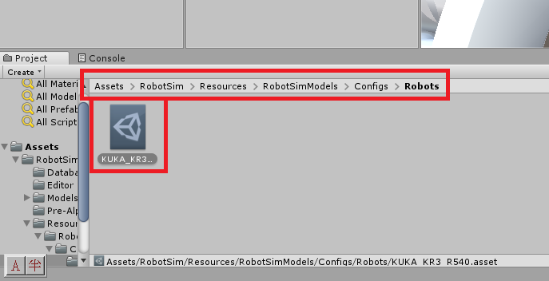
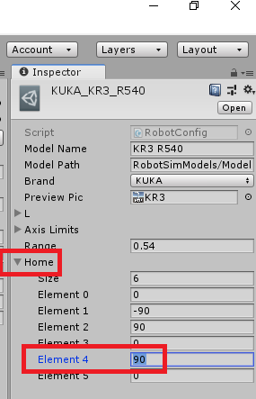
- 加入夾爪模型(用Sphere代替)

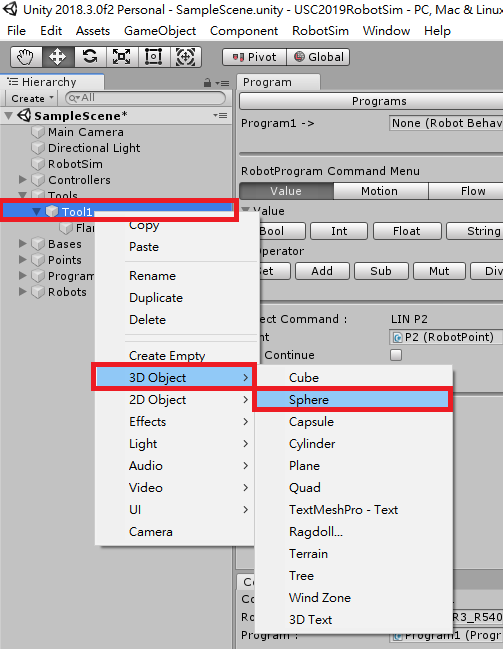
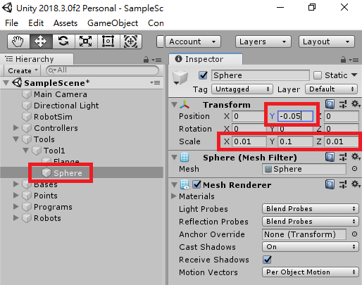
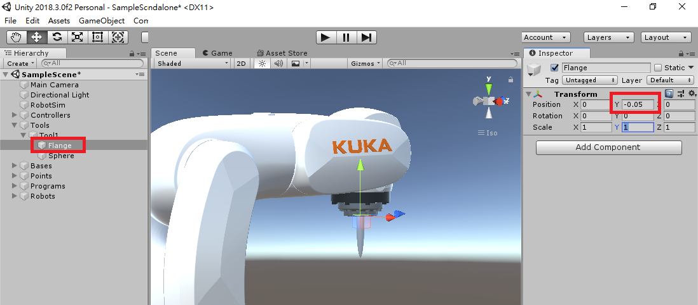
- 加入Gripper程式(實踐課程試用版 Trial_0_1_6991 內已包含)

```cs
//Gripper.cs
using System.Collections;
using System.Collections.Generic;
using UnityEngine;

public class Gripper : MonoBehaviour
{
	// Gripper程式會有2種模擬夾取
	// 1.利用OnTriggerEnter自動取得在夾取範圍內的物件，夾取指令時將該物件的parent設為Gripper
	// 2.以夾爪播放夾取動畫的方式移動夾爪，並利用Rigidbody產生夾取

	//準備夾取的物件
	public Transform readyGet;
	//目前夾持的物件
	public Transform holdingObject;

	//夾取指令(將readyGet物件Parent設為Gripper)
	public void Lock(Transform product)
	{
		if (holdingObject == null)
		{
			if (product)
			{
				product.transform.parent = transform;
				holdingObject = product;
			}
		}
	}

	//傳回目前所夾持物
	public Transform Unlock()
	{
		Transform returnObject = holdingObject;
		holdingObject = null;//清空目前所持物

		return returnObject;
	}

	//夾取readyGet物件
	public void LockReadyGet()
	{
		Lock(readyGet);
	}
	//放開夾取物件
	public void UnlockToWorld()
	{
		if (holdingObject)
		{
			holdingObject.parent = null;
		}
		holdingObject = null;//把手上拿著的東西丟到世界Root去
	}
	//偵測目前可夾取物
	void OnTriggerEnter(Collider other)
	{
		readyGet = other.transform;
	}
	//移除目前圖夾取物
	void OnTriggerExit(Collider other)
	{
		if (readyGet == other.transform)
		{
			readyGet = null;
		}
	}
}

```
- 加入GripperCommand(實踐課程試用版 Trial_0_1_6991 內已包含)

```
//RobotCommandGripper.cs
using UnityEngine;
using RobotSim;
using System;

public class RobotCommandGripper : RobotCommand
{
	//對應操作的夾爪
	public Gripper gripper;
	//夾爪動畫
	public Animator animatorGripper;
	//夾持命令
	public bool Lock = false;

	//檢查是否有設定好夾爪
	public override bool Check()
	{
		if (gripper)
		{
			return true;
		}
		else
		{
			errorMassage = "Gripper is NULL";
			return false;
		}
	}

	//執行夾爪動作
	public override int Execute()
	{
		if (Lock)
		{
			//夾取(以設定Parent方式)
			gripper.LockReadyGet();
			//夾取(播放動畫)
			if (animatorGripper)
			{
				animatorGripper.speed = 1;
				animatorGripper.Play("Lock", -1, 0);
			}
		}
		else
		{
			//放開(以設定parent方式)
			gripper.UnlockToWorld();
			//放開(播放動畫)
			if (animatorGripper)
			{
				animatorGripper.speed = 1;
				animatorGripper.Play("UnLock", -1, 0);
			}
		}
		//動作完成，執行下一行
		return (line + 1);
	}

	public override string ExportDat()
	{
		//不需要輸出任何程式到Dat檔
		return "";
	}

	public override string ExportSrc()
	{
		//輸出  GripperLock(true/false);  至 手臂程式src檔內
		return tab + "GripperLock(" + Lock.ToString() + ");" + Environment.NewLine;
	}

	public override string UpdateName()
	{
		//更新Gameobject在階層視窗內的名稱
		return (gameObject.name = "GripperLock(" + Lock.ToString() + ")");
	}

}
```
- 調整夾爪碰撞範圍(用來偵測範圍內是否有物體可以夾)


- 加入物體

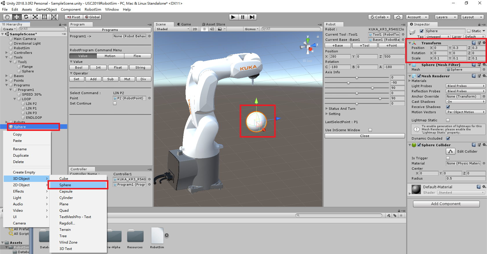
- 夾爪加入Gripper功能

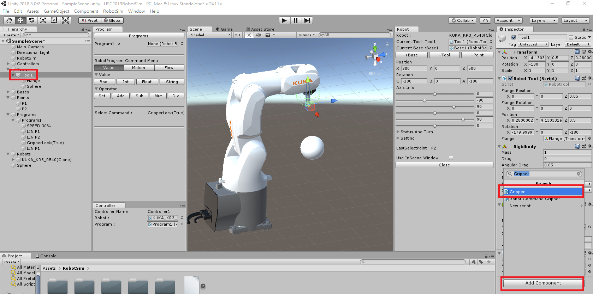
- Program中加入Empty GameObject後加入GripperCommand功能


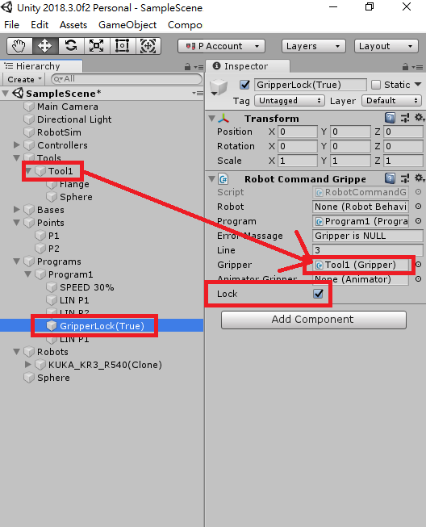

- 測試

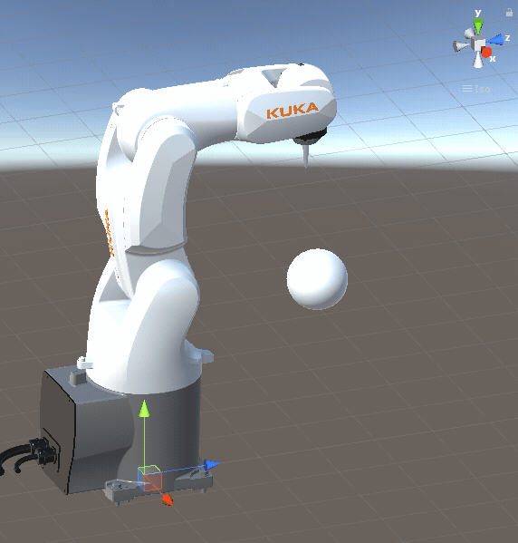
- 來回夾放測試

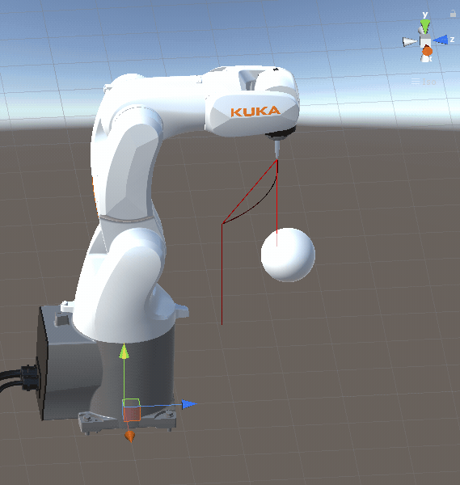


- 在RobotSim 中還能做什麼?
  - [歡迎加入RobotSim討論區](http://forum.wtech.com.tw/viewforum.php?f=17&sid=4a42cdd8643e5518dd23f732ca23f0c4).
  
### RobotSim匯出 並匯入WorkVisual專案
- WorkVisual 環境

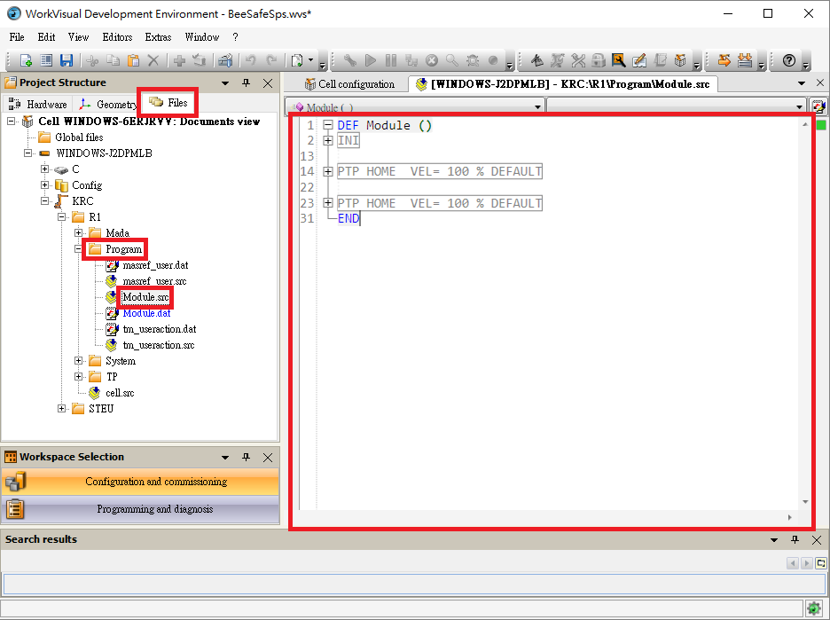
- RobotSim 匯出程式

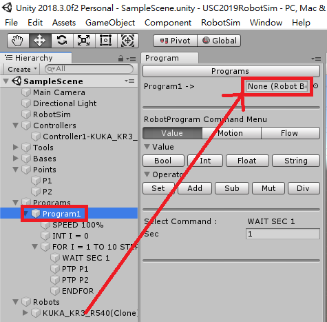

- WorkVisual 匯入程式

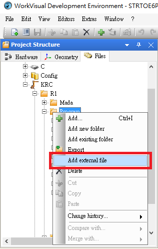
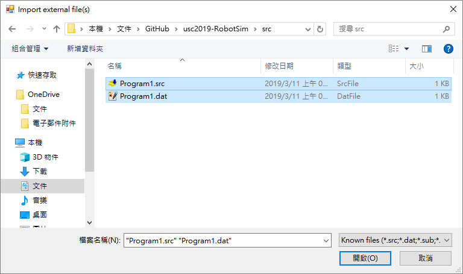


<!--stackedit_data:
eyJoaXN0b3J5IjpbLTkwMjI2OTk1MSw0NDM4NTEyNSwtNDAyMj
gyNjA2LDEwNDM2MjUwMjksMzUwNjg5MjgsLTE5NTI2NDM5MTUs
MTc4NDU3MDQ2LDIxMzc3Mjc1NjgsNzc0ODQxNzMxLC0xOTY4Nj
k5NzI0LDY0NTA2NjgzNiwtMTIzMTQ1NTEzLDE4NDQwMzQ4NjYs
OTg5MjI5NzAzLC02NTAxMDgzNDYsLTM5ODk2MzA3MywxMTczNT
k5ODY2LC00MTYxNjk2NjcsLTU3MDgzMjY1MSwxNDAyNDE0MTU1
XX0=
-->