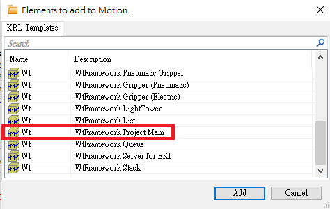
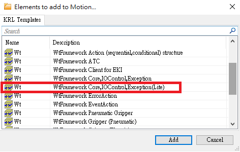
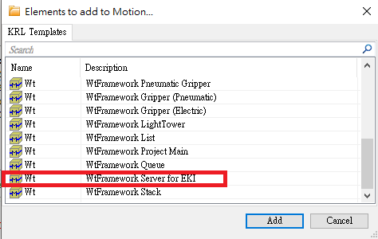
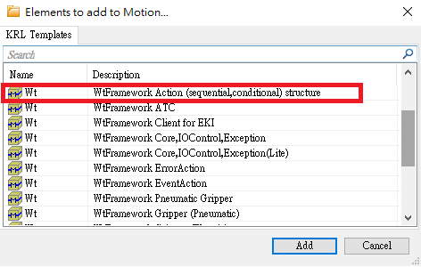
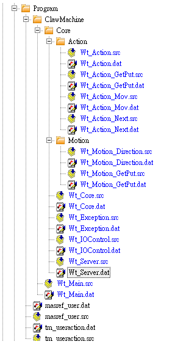
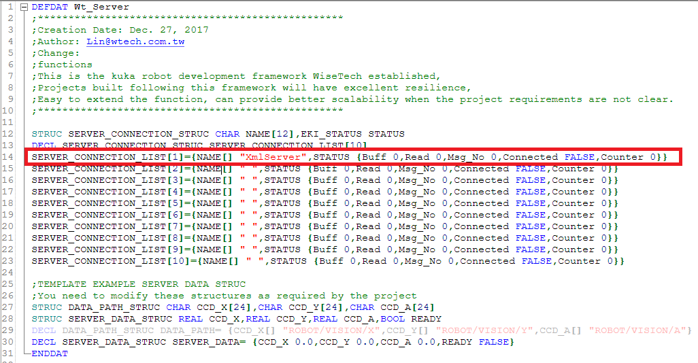
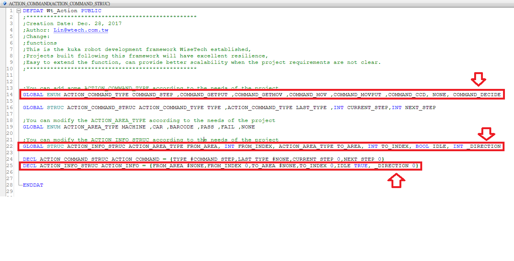

## 六、自動化專案實作 二
### KUKA Srver端通訊程式

<iframe width="560" height="315" src="https://www.youtube.com/embed/7dYWyvtd1mo" frameborder="0" allow="accelerometer; autoplay; encrypted-media; gyroscope; picture-in-picture" allowfullscreen></iframe>

<iframe width="560" height="315" src="https://www.youtube.com/embed/DA_odS-_jwk" frameborder="0" allow="accelerometer; autoplay; encrypted-media; gyroscope; picture-in-picture" allowfullscreen></iframe>

1.建立專案資料夾、加入框架程式
- 建立ClawMachine資料夾
	- 加入Main程式、Core資料夾
	- 
- Core資料夾
	- 加入 Core、Server 程式以及Action、Motion 資料夾
	- 
	- 
- Action資料夾
	- 加入Action程式
	- 
		 - 加入 Wt_Action_GetPut、Wt_Action_Decide
- Motion資料夾
	- 加入 Wt_Motion_Direction、Wt_Motion_GetPut 
- 


2.撰寫框架Server程式
  - 定義中斷條件，確認手臂是否有收到資料
  
```sh
GLOBAL DEF Server()  
   
   ;定義Flag[2]=true 中斷所有動作 執行Data_In
   GLOBAL INTERRUPT DECL 101 WHEN $FLAG[2]==TRUE DO Data_In()
   $FLAG[2] = FALSE  			;初始化
   INTERRUPT ON 101  			;宣告
   
   Server_Set_Ready(FALSE) 		;初始化ready
END
```

- Data_In_CCD( )為判斷接收資料後執行程式

```sh
DEF Data_In()  
   DECL EKI_STATUS RET  
   INT _DIRECTION  
   CHAR CHANNEL_NAME[24]
  
   _DIRECTION = 0  
   CHANNEL_NAME[] = SERVER_CONNECTION_LIST[1].NAME[]
  
   RET = EKI_GetInt(CHANNEL_NAME[],"Data/Direction",_DIRECTION)  ;接收資料
  
   IF Action_Get_Idle() THEN  					;Idle為閒置狀態
      Action_Set_Command_Info(_DIRECTION)  			;將收到資料傳至Info
      Action_Set_Command_Type(#COMMAND_DECIDE)  		;將Action Type改為判斷
      Server_Set_Ready(TRUE)  					;Server確認收到資料 可執行
   ENDIF  
  
   $FLAG[2] = FALSE  						;初始化Flag[2]
END
```

- 加入回傳訊息程式，告訴 PC 已完成動作

```sh
GLOBAL DEF Send()  
   DECL EKI_STATUS RET  
   DECL CHAR EOL[2]  
   CHAR CHANNEL_NAME[24]
   
   EOL[1] = 13  
   EOL[2] = 10  									;ASCII碼 換行字元
   CHANNEL_NAME[] = SERVER_CONNECTION_LIST[1].NAME[]

   RET = EKI_Send(CHANNEL_NAME[], "Finish")  		;傳送結束字串
   RET = EKI_Send(CHANNEL_NAME[], EOL[])  		;傳送換行字元
END
```

- 定義Server.dat檔
	- SERVER_CONNECTION_LIST[1].NAME[ ] 設定為 "XmlServer"
	

3.在Core需初始化及判斷條件進入Action
- Core初始化

```sh
GLOBAL DEF Core ()  
   BAS(#BASE, 0)  		;設定base
   BAS(#TOOL, 1)  		;設定tool
  

   IOControl()  		;IO初始化
   Exception()  		;事件初始化
  
   		 
   Server()  			;Server初始化 	
   Action_Set_Idle(TRUE)
   Server_Start(1)  			;開啟Server
END
```

- Core_Run判斷進入Action條件

```sh
GLOBAL DEF Core_Run()  
  
   PTP XHOME  		;home點
  
   REPEAT  
  
      WHILE ( ( NOT Event() ) AND ( NOT Error() ) )  
  
      IF Server_Get_Ready() THEN  		;判斷Ready
         Action()  
      ENDIF  
  
      ENDWHILE  
   
   UNTIL SYS_EXIT  
END
```

- 需將 XHOME 點 A5 軸改為 90度
	- 在Core_Run()  XHOME 上點按F12
	- XHOME1 A5也需要改90度 A1改為45度

4.Action判斷條件
- 需再Action.dat檔內加入宣告

```sh
 GLOBAL ENUM ACTION_COMMAND_TYPE COMMAND_DECIDE		;新增一個判斷枚舉
 GLOBAL STRUC ACTION_INFO_STRUC INT _DIRECTION		;新增方向INT
 DECL ACTION_INFO_STRUC ACTION_INFO 加入 _DIRECTION 0	;加入INFO 初始直為0
```



- Action內判斷現在需要執行內容

```sh
GLOBAL DEF Action ( )  
   Action_Before()  		;Action開始前要做的事
  
   SWITCH ACTION_COMMAND.TYPE  		
  
   CASE #COMMAND_DECIDE  		;判斷是移動還是夾
	   Wt_Action_Decide(ACTION_INFO)  	
	   RETURN  
   
   CASE #COMMAND_MOV  		;移動
	   Wt_Action_Mov(ACTION_INFO)  
  
   CASE #COMMAND_GETPUT  		;夾
	   Wt_Action_GetPut()  
  
   ENDSWITCH  
  
   Action_After()  		;Action結束後要做的事
END
```

- Action結束後 After需要判斷此次命令動作是否結束

```sh
DEF Action_After()  
  
   IF (NOT Event()) AND (NOT Error()) THEN  
      SWITCH ACTION_COMMAND.TYPE  		;如果是移動or夾
         CASE #COMMAND_MOV  
            Server_Set_Ready(FALSE)  		;Ready = FALSE
            Action_Set_Idle(TRUE)  		;Idle改回TRUE
            Send()  				;傳送結束指令
         CASE #COMMAND_GETPUT  
            Server_Set_Ready(FALSE)  
            Action_Set_Idle(TRUE)  			
            Send()  
         DEFAULT  
      ENDSWITCH  
   ENDIF  
END
```

- 讓程式能從外面變更Type、Info

```sh
GLOBAL DEF Action_Set_Command_Type(_COMMAND_TYPE:IN)  
   DECL ACTION_COMMAND_TYPE _COMMAND_TYPE  
  
   ACTION_COMMAND.TYPE = _COMMAND_TYPE  	;下一步改為判斷
END 
``` 

```sh  
GLOBAL DEF Action_Set_Command_Info(_TO_INDEX:IN)  
   INT _TO_INDEX  
  
   ACTION_INFO._DIRECTION = _TO_INDEX  		;Server接收到資料存進Info
END
```

- 判斷 Wt_Action_Decide() 下一步為 Mov 還是 GetPut

```sh
DEF Wt_Action_Decide (_ACTION_INFO:IN )  
   DECL ACTION_INFO_STRUC _ACTION_INFO  
  
   SWITCH _ACTION_INFO._DIRECTION  
      CASE 5  					;夾 5
         Action_Set_Command_Type(#COMMAND_GETPUT)  
      DEFAULT  					;移動 1~4
         Action_Set_Command_Type(#COMMAND_MOV)  
   ENDSWITCH  
END
```

- Action_Mov呼叫Motion

```sh
DEF Wt_Action_Mov ( _ACTION_INFO:IN )  
   DECL ACTION_INFO_STRUC _ACTION_INFO  
  
   Wt_Motion_Direction(_ACTION_INFO._DIRECTION)		;呼叫motion並經INFO的位置數值傳入  
END
```

- Action_GetPut()呼叫Motion

```sh
DEF Wt_Action_GetPut ()  
   Wt_Motion_GetPut ()  
END
```

5.Motion執行動作

- Motion動作 : 移動

```sh
DEF Wt_Motion_Direction (_DIRECTION:IN)  
   INT _DIRECTION, DISTANCE_ADD, DISTANCE_DEL  
   E6POS POSITION  
  
   DISTANCE_ADD = 100  		;移動距離
   DISTANCE_DEL = -100  	
  
   POSITION = {X 0,Y 0,Z 0,A 0,B 0,C 0}  
  
   SWITCH _DIRECTION  
      CASE 1  						;前
         POSITION.X = DISTANCE_ADD  
      CASE 2  						;後  
         POSITION.X = DISTANCE_DEL  
      CASE 3  						;左  
         POSITION.Y = DISTANCE_ADD  
      CASE 4  						;右  
         POSITION.Y = DISTANCE_DEL  
   ENDSWITCH  
  
   LIN_REL POSITION  				;移動至運算結果位置
  
END
```

- Motion動作 : 夾

```sh
DEF Wt_Motion_GetPut ()  
   INT DISTANCE_ADD, DISTANCE_DEL  
   E6POS POSITION  
  
   DISTANCE_ADD = 100  
   DISTANCE_DEL = -100  
  
   POSITION = {X 0,Y 0,Z 0,A 0,B 0,C 0}  
  
   POSITION.Z = DISTANCE_DEL  		;Z軸向下
  
   LIN_REL POSITION  				;移動至運算結果位置  
  
   POSITION.Z = DISTANCE_ADD  		;Z軸向上
  
   LIN_REL POSITION  		
  
   PTP XHOME1  						;至放置點
  
   PTP XHOME						;回HOME點
END
```

6.XmlServer設定檔

```xml
<ETHERNETKRL>  
	<CONFIGURATION>  
		<EXTERNAL>  
			<TYPE>Client</TYPE>  
		</EXTERNAL>  
		<INTERNAL>  
			<IP>172.31.1.147</IP>  
			<PORT>54600</PORT>  
			<ALIVE Set_Flag="1"/>  
		</INTERNAL>  
	</CONFIGURATION>  
	<RECEIVE>  
		<XML>  
			<ELEMENT Tag="Data/Direction" Type="INT" Set_Flag="2"/>  
		</XML>  
	</RECEIVE>  
	<SEND>  
		<XML>  
		</XML>  
	</SEND>  
</ETHERNETKRL>
```
<!--stackedit_data:
eyJoaXN0b3J5IjpbNTkxNjczNDg5LC0yMDE1MjIxNDc3LDE2ND
Q0MTE5MzAsNDc3MDE0OTA4LC05MTcyMTYwNjAsLTUyMzk0MzQ0
MSwyMDE4MTg3NzIzLC0xNTYyMzk0MTY1LDkwMzIzMzQxMiwxNT
E3NTUzNjg2LDMyNjA3ODEyMCwtMTA4MzczNjIyMCwtMzcyMTc4
MDMxLDUzNTY2MjQyNSwtMTQ1MzI5MDk5NywyMDA2MzEzNDE2LC
03NjcyNjQxMDEsMTY5NDEwNjM5NCwtNDkzODc0NDc1LDI0NDI2
MzgwNl19
-->